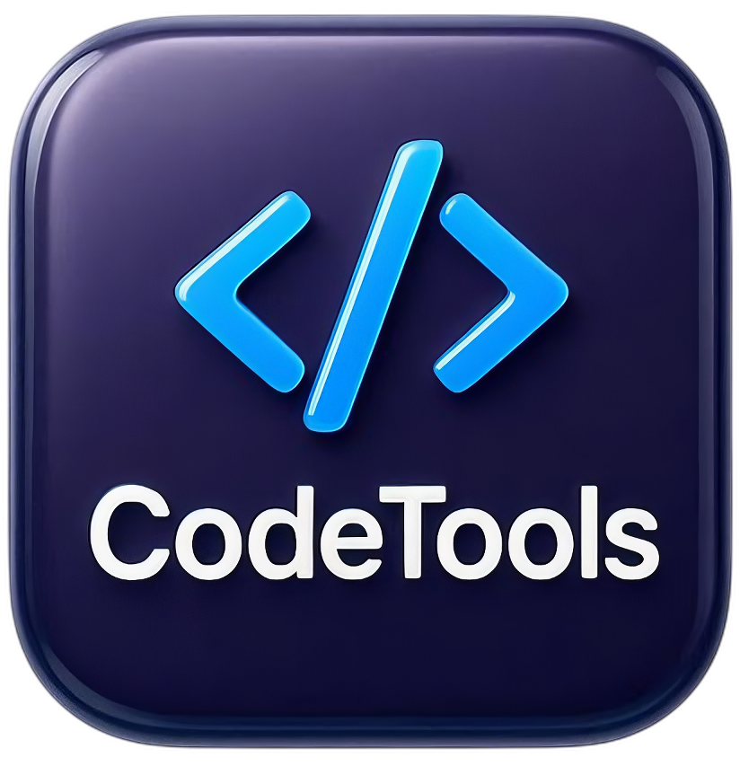
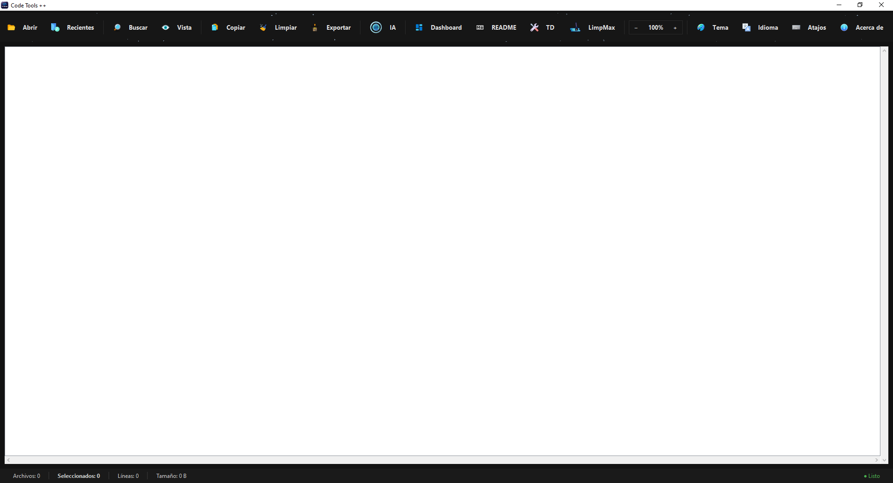
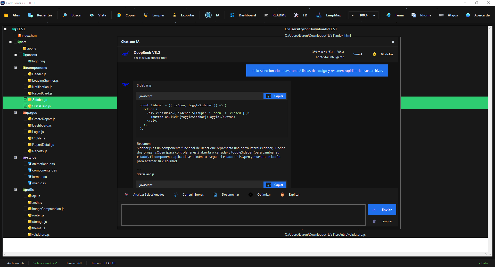
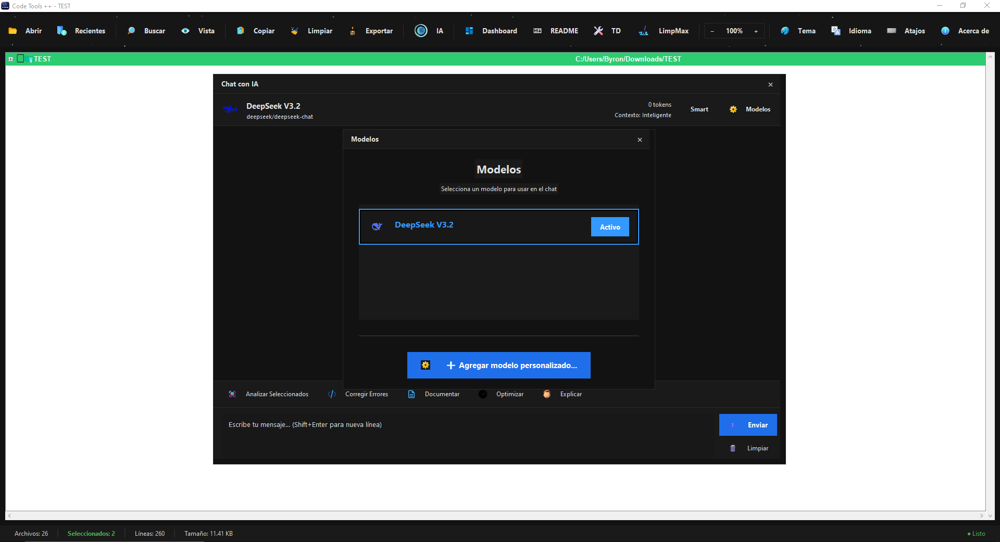
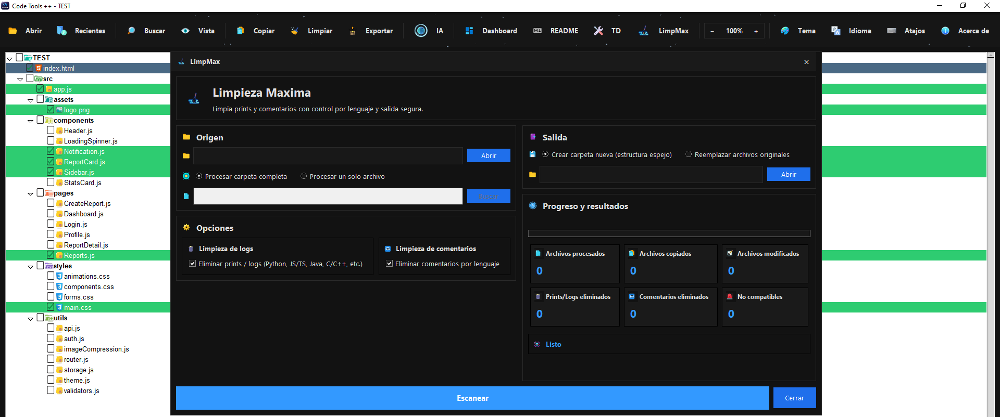
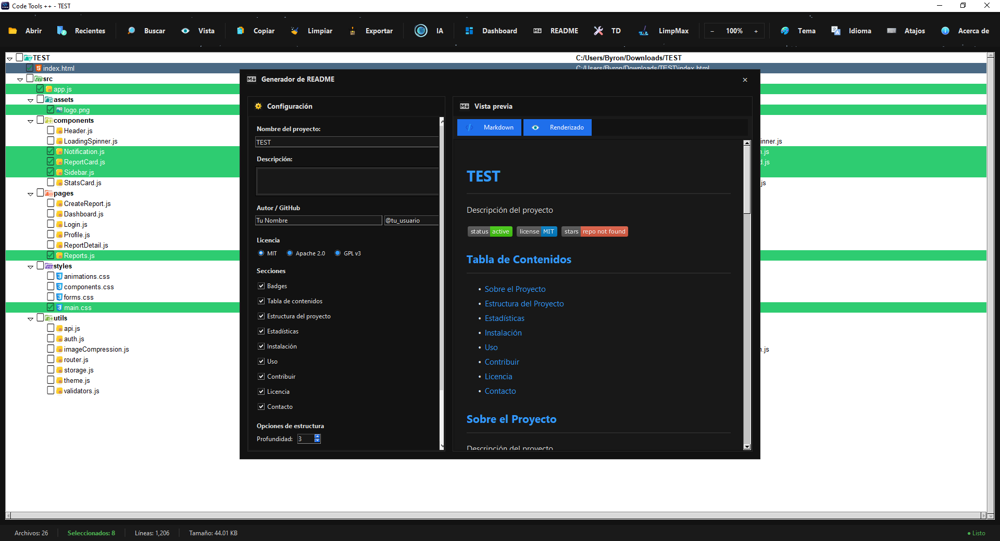

<div align="center">
  
  <h1>Code Tools ++</h1>

  <p><strong>Настольный инструментарий на базе ИИ для разработчиков, работающих с большими кодовыми базами.</strong><br>
  Изучайте, анализируйте, очищайте, документируйте и общайтесь со своим кодом — всё в одном интерфейсе.</p>
  <p>Язык: нажмите на флаг</p>

  <p align="center">
    <a href="../../README.md"></a>
    <a href="README.es.md"></a>
    <a href="README.zh.md"></a>
    <a href="README.ru.md"></a>
  </p>

  <p>
    <a href="#установка"></a>
    <a href="#установка"></a>
    <a href="#технологии"></a>
    <a href="#чат-с-ии--движок-моделей"></a>
    <a href="#лицензия"></a>
  </p>

  <p>
    <a href="#возможности">Возможности</a> •
    <a href="#чат-с-ии--движок-моделей">Движок ИИ</a> •
    <a href="#установка">Установка</a> •
    <a href="#быстрый-старт-30-секунд">Использование</a> •
    <a href="#архитектура-проекта">Архитектура</a> •
    <a href="#дорожная-карта">Дорожная карта</a>
  </p>

  <hr>

  <p><em>Хватит копировать файлы вручную. Хватит переключаться между 5 инструментами. Начните поставлять результат.</em></p>
</div>

---
## ⬇️ Скачать

<div align="center">

<h3>Code Tools ++ v1.0.0</h3>

<a href="https://fastxstudios.github.io/CodeToolsLandingPage/">
  
</a>
&nbsp;
<a href="https://fastxstudios.github.io/CodeToolsLandingPage/">
  
</a>

</div>

---

## Почему Code Tools ++?

Каждый разработчик, который когда-либо готовил кодовую базу для проверки ИИ, аудита или релиза, проходил через это:

1. Вручную открывать папки и выбирать файлы по одному.
2. Копировать и вставлять содержимое в промпт — надеясь, что ничего не упустил.
3. Отдельно искать TODO/FIXME и мёртвый код.
4. Очищать `print()` файл за файлом.
5. Писать README с нуля в конце спринта.

**Code Tools ++ устраняет всё это.** Это нативное десктопное приложение (Python + Tkinter), созданное специально для рабочих процессов, которыми разработчики реально пользуются — со встроенным ИИ-ассистентом как полноценной функцией, а не дополнением.

---

## Возможности

### 🤖 Чат с ИИ & Движок моделей

Это ключевое отличие. Code Tools ++ поставляется с полноценным интерфейсом диалогового ИИ, напрямую подключённым к выбранным файлам.

**Встроенная модель:** [DeepSeek](https://platform.deepseek.com/) — высокопроизводительная и экономичная LLM, оптимизированная для задач с кодом.

**Поддержка пользовательских моделей через [OpenRouter](https://openrouter.ai/):** Добавьте любую модель, доступную на OpenRouter (GPT-4o, Claude, Gemini, Mistral, LLaMA и др.), указав ID модели и API-ключ. Без дополнительных зависимостей. Выбор модели поддерживает анимированные GIF-логотипы для каждой модели, постоянное сохранение выбора между сессиями и удаление пользовательских записей одним кликом.

**Режимы контекста:**
- `Smart` — отправляет метаданные файла (имя, расширение, количество строк, размер) для лёгких контекстных запросов.
- `Full` — отправляет полное содержимое файлов для глубокого анализа, рефакторинга и генерации документации.

**Встроенные действия (промпты в один клик):**

| Действие | Что делает |
|---|---|
| **Анализировать** | Проверяет выбранные файлы на структуру, паттерны и проблемы |
| **Исправить ошибки** | Находит баги и предлагает исправленный код |
| **Документировать** | Генерирует встроенные докстринги и документацию на уровне функций |
| **Оптимизировать** | Предлагает улучшения производительности и рефакторинг |
| **Объяснить** | Создаёт понятные объяснения того, что делает код |

**Рендеринг Markdown в чате:** Ответы ИИ отображают блоки кода с подсветкой синтаксиса (Python, JS/TS, JSON, Bash), кнопкой копирования для каждого блока и автоматическим переносом текста — не просто как сырой текст.

**Сохранение состояния:** История чата, выбранная модель, режим контекста и счётчик использования токенов сохраняются на диск и восстанавливаются между сессиями.

---

### 🗂️ Интеллектуальный проводник репозитория

- Дерево файлов с рекурсивным выбором через флажки.
- Визуальные предупреждения для тяжёлых/игнорируемых директорий (`node_modules`, `venv`, `.git`, `dist` и др.) до случайного их включения.
- История недавних папок с визуальным меню и очисткой одним кликом.
- Расширенный поиск файлов с быстрой навигацией.

---

### 📤 Профессиональный экспорт для ИИ и ежедневной работы

Четыре режима экспорта, разработанные для реальных рабочих процессов разработчиков:

| Режим | Вывод |
|---|---|
| **Копировать с содержимым** | Полное содержимое файлов, объединённое |
| **Копировать только пути** | Относительные пути выбранных файлов |
| **Копировать дерево** | ASCII-структура директорий |
| **Копировать для LLM** | Структурированный формат, оптимизированный для ИИ-промптов — с путями, маркерами языка и чистыми разделителями |

Все режимы доступны из стилизованного меню экспорта. Сохранение в файл доступно напрямую.

---

### 📊 Панель технического качества

Единое представление того, на сбор чего иначе ушло бы 20 минут:

- **Статистика проекта:** общее количество файлов, строк кода, распределение по размеру.
- **Трекер TODO/FIXME:** список каждой аннотации с указанием местоположения в файле.
- **Детектор дубликатов:** отмечает файлы с идентичным или почти идентичным содержимым.
- **Распределение по языкам:** разбивка по типу файла с ключевыми метриками.

Внешние инструменты не требуются. Работает полностью на локальном проекте.

---

### 🧹 LimpMax — Безопасная массовая очистка кода

Удаляет артефакты разработки перед коммитами, релизами или код-ревью:

- Удаляет операторы `print()` / `console.log()` / `logging.*` по правилам каждого языка.
- Удаляет встроенные комментарии (настраивается для каждого языка).
- Создан для очистки перед сдачей — быстро, детерминированно, и обратимо при использовании вместе с системой контроля версий.

---

### 📝 Встроенный генератор README

- Генерирует полный README в Markdown на основе структуры проекта.
- Живой предпросмотр с рендерингом Markdown.
- Перевод на другой язык в реальном времени (ES / EN / ZH / RU) — смените язык, и предпросмотр обновится мгновенно.
- Полезно для стандартизации документации в командах или быстрой публикации открытых проектов.

---

### ⚡ UX, созданный для скорости

- Пользовательские меню (`Недавние`, `Экспорт`) с PNG-иконками.
- Предпросмотр файлов в реальном времени.
- Горячая смена темы и языка без перезапуска.
- Горячие клавиши для непрерывного рабочего процесса.

| Сочетание клавиш | Действие |
|---|---|
| `Ctrl+O` | Открыть папку |
| `Ctrl+Q` | Выйти из приложения |
| `F5` | Обновить дерево файлов |
| `E` / `Пробел` | Отметить / Снять отметку с файла |
| `Ctrl+C` | Копировать выбранное |
| `Ctrl+D` | Очистить выделение |
| `Ctrl+F` | Поиск файлов |
| `Ctrl+P` | Показать/Скрыть предпросмотр |
| `Двойной клик` | Отметить файл |
| `Правый клик` | Открыть контекстное меню |
| `Ctrl++` | Увеличить масштаб |
| `Ctrl+-` | Уменьшить масштаб |
| `Ctrl+0` | Сбросить масштаб |
| `Ctrl+Прокрутка` | Масштаб колесом мыши |

---

## Поддерживаемые языки (интерфейс)

`Español` · `English` · `中文` · `Русский`

---

## Установка

### Предварительные требования

- Python 3.12+
- Windows (основная платформа), Linux/macOS (работоспособно, не полностью протестировано)

### 1. Клонировать

```bash
git clone https://github.com/FastXStudios/CodeToolsPP.git
cd CodeToolsPP
```

### 2. Создать виртуальное окружение

**Windows (PowerShell):**
```powershell
python -m venv .venv
.\.venv\Scripts\Activate.ps1
```

**Linux / macOS:**
```bash
python -m venv .venv
source .venv/bin/activate
```

### 3. Установить зависимости

```bash
pip install -r requirements.txt
```

### 4. Запустить

```bash
python main.py
```

---

## Быстрый старт (30 секунд)

```
1. Откройте папку проекта      →  Ctrl+O
2. Выберите нужные файлы       →  дерево с флажками
3. Откройте чат ИИ             →  спросите что угодно о коде
4. Экспортируйте контекст LLM  →  Меню экспорта → Копировать для LLM
5. Проверьте панель            →  найдите TODO, дубликаты, метрики
6. Запустите LimpMax           →  уберите отладочные логи перед коммитом
7. Создайте README             →  Инструменты → Генератор README
```

---

## Настройка ИИ

### Использование встроенной модели DeepSeek

DeepSeek предварительно настроен. Добавьте ваш API-ключ в **Настройки → ИИ → API-ключ**.  
Получите ключ на [https://openrouter.ai/](https://openrouter.ai/).

### Добавление пользовательской модели (OpenRouter или любой OpenAI-совместимый эндпоинт)

1. Откройте окно чата ИИ.
2. Нажмите **Выбрать модель → Добавить пользовательскую модель**.
3. Заполните:
   - **Имя** — отображаемое название (например, `GPT-4o`)
   - **ID модели** — как указано на OpenRouter (например, `openai/gpt-4o`)
   - **API-ключ** — ваш ключ OpenRouter
   - **Макс. токенов** — ограничение контекстного окна
   - **Логотип** — опциональный PNG/GIF для карточки модели
4. Сохраните. Модель сразу появится в селекторе.

Модели OpenRouter включают: `openai/gpt-4o`, `anthropic/claude-3-5-sonnet`, `google/gemini-pro`, `meta-llama/llama-3-70b-instruct`, `mistralai/mistral-large` и сотни других.

---

## Архитектура проекта

```
main.py
├── core/
│   ├── ai_manager.py          # Реестр моделей, вызовы API, подготовка контекста
│   ├── code_analyzer.py       # Статический анализ, обнаружение TODO/FIXME
│   ├── export_manager.py      # Все форматы экспорта, включая режим LLM
│   ├── file_manager.py        # Файловый ввод/вывод, метаданные, информационные запросы
│   ├── limpmax_processor.py   # Движок очистки кода с учётом языка
│   ├── project_stats.py       # Агрегация метрик
│   ├── selection_manager.py   # Управление состоянием флажков
│   └── startup_preloader.py   # Фоновая инициализация
├── gui/
│   ├── main_window.py
│   ├── tree_view.py
│   ├── preview_window.py
│   ├── dashboard_window.py
│   ├── ai_window.py           # Полный интерфейс чата ИИ с рендерингом Markdown
│   ├── limpmax_window.py
│   ├── search_dialog.py
│   ├── readme_generator_dialog.py
│   ├── recent_folders_menu.py
│   ├── export_menu.py
│   ├── widgets/
│   └── components/
└── utils/
    ├── config_manager.py
    ├── language_manager.py    # i18n: ES / EN / ZH / RU
    ├── theme_manager.py
    ├── file_icons.py
    ├── alerts.py
    └── helpers.py
```

---

## Технологии

| Уровень | Технология |
|---|---|
| Язык | Python 3.12+ |
| GUI | Tkinter / ttk |
| Изображения | Pillow |
| Рендеринг HTML | tkinterweb |
| Графики | matplotlib |
| Markdown | markdown2 |
| HTTP | requests |
| Буфер обмена | pyperclip |
| ИИ | OpenAI-совместимый REST API (DeepSeek, OpenRouter) |

---

## Сборка исполняемого файла (PyInstaller)

```powershell
  .\.venv\Scripts\python.exe -m PyInstaller
  --noconfirm --clean --onefile 
  --windowed --name "CodeToolsPP" 
  --icon ".\icon.ico" --add-data ".\assets;assets" 
  --add-data ".\data;data" 
  --add-data ".\icon.ico;." 
  --hidden-import "PIL._tkinter_finder" 
  --collect-submodules "PIL" 
  --collect-data "tkinterweb" 
  .\main.py
```

Результат: `dist/CodeToolsPP.exe`

---

## Скриншоты

**Главный интерфейс:** Главный интерфейс с панелью инструментов и счётчиками файлов, строк и размера.


**Чат ИИ:** Чат ИИ с параметрами анализа файлов.


**Выбор модели:** Селектор моделей ИИ с активным DeepSeek V3.2 и возможностью добавления пользовательских моделей.


**Меню экспорта:** Меню экспорта с параметрами копирования путей, древовидной структуры и формата для LLM.


**Панель:** Панель статистики с распределением файлов, гистограммой и разбивкой на страницы.


**LimpMax:** Инструмент максимальной очистки для удаления print/логов и комментариев по языкам.


**Генератор README:** Генератор README с настраиваемыми разделами, бейджами и предпросмотром.


---

## Реальные сценарии использования

- **Отладка с помощью ИИ:** Выберите сломанный модуль → откройте чат ИИ → «Почему эта функция возвращает None?» — полный контекст файла отправляется автоматически.
- **Аудит перед рефакторингом:** Откройте устаревший репозиторий → панель покажет распределение языков, количество TODO и дублирующиеся файлы за секунды.
- **Очистка перед коммитом:** Запустите LimpMax, чтобы удалить все операторы `print()`/`console.log()` в 40 файлах одновременно.
- **Техническая документация:** Создайте README на основе структуры проекта, переведите на английский или китайский, экспортируйте — менее чем за 2 минуты.
- **Онбординг команды:** Проведите нового разработчика по структуре проекта, используя экспорт дерева + оптимизированную копию для LLM для мгновенной ориентации.
- **Подготовка к код-ревью:** Экспортируйте выбранные файлы в виде контекста LLM, вставьте в предпочитаемый ИИ без какого-либо шума.

---

## Дорожная карта

- [ ] Оптимизация производительности для очень больших репозиториев (>10k файлов)
- [ ] Больше пресетов экспорта LLM (шаблоны системных промптов, осведомлённость о бюджете токенов)
- [ ] Расширенные правила LimpMax и средства контроля безопасности для отдельных файлов
- [ ] Автоматизированный набор тестов
- [ ] Конвейер релизов и поддержка автоматического обновления
- [ ] Пакеты для Linux/macOS

---

## Участие в разработке

1. Сделайте форк репозитория.
2. Создайте ветку: `git checkout -b feature/your-improvement`
3. Сделайте коммит: `git commit -m "feat: your improvement"`
4. Отправьте: `git push origin feature/your-improvement`
5. Откройте Pull Request.

---

## Сторонние ресурсы

Этот проект использует иконки из:

**vscode-material-icon-theme**  
Copyright (c) 2025 Material Extensions  
Лицензия MIT  
https://github.com/material-extensions/vscode-material-icon-theme  

Оригинальная лицензия включена в директорию `licenses/`.

---

## Лицензия

[Лицензия MIT](LICENSE)

---

## Автор

**Byron Vera**  
GitHub: [FastXStudios](https://github.com/FastXStudios/CodeToolsPP)  
Email: byronvera113@gmail.com